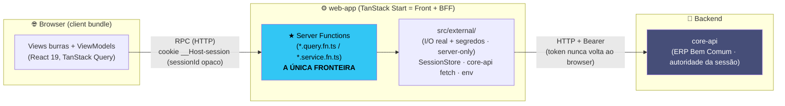
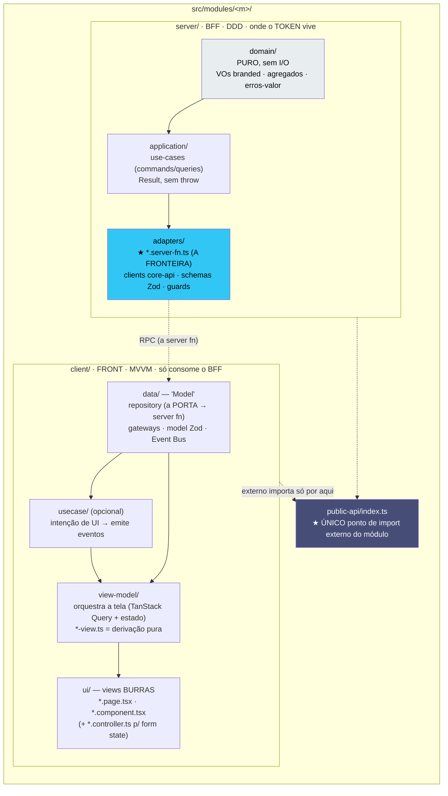
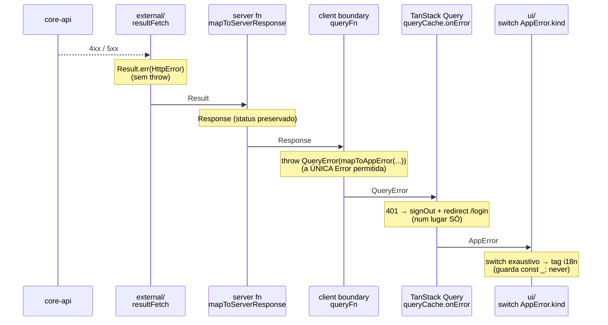
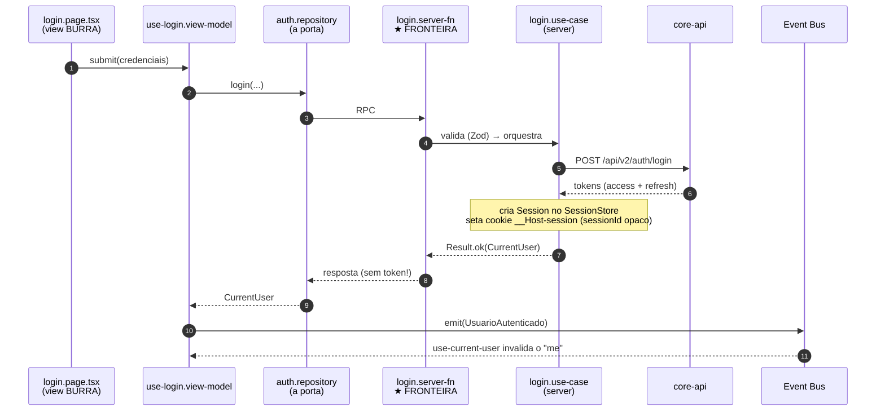
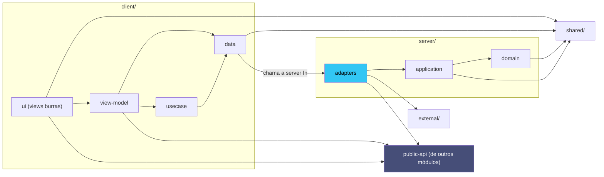
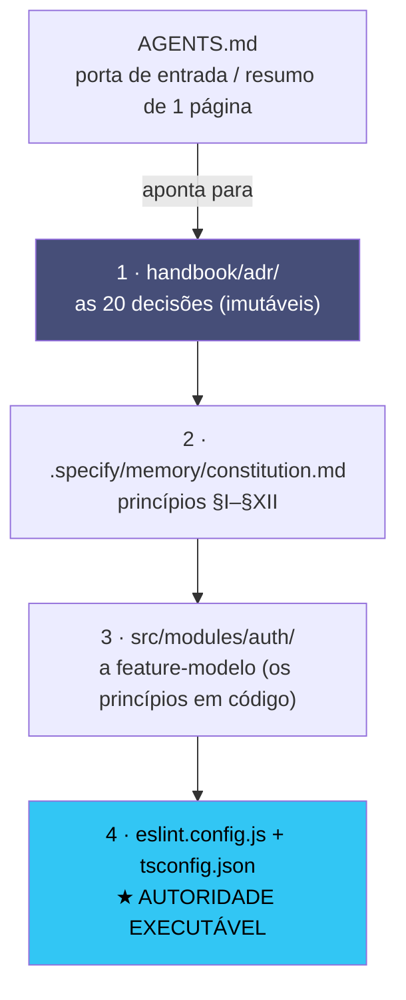

# Arquitetura do web-app — Mapa Visual Consolidado

> **O que é este documento.** Um **mapa visual único** que costura, em diagramas, *como esta
> arquitetura foi montada*: o front + BFF unificado, os módulos verticais com split client×server, a
> cadeia de erro fim-a-fim e as fronteiras de import. É um **guia de leitura**, não uma nova fonte de
> verdade.
>
> **Fonte de verdade (em divergência, vence nesta ordem):**
> 1. [`handbook/adr/`](./adr/) — as 20 decisões arquiteturais (imutáveis).
> 2. [`.specify/memory/constitution.md`](../.specify/memory/constitution.md) — princípios §I–§XII (v1.2.1).
> 3. [`src/modules/auth/`](../src/modules/auth/README.md) — a **feature-modelo** (os princípios em código).
> 4. **Autoridade executável:** [`eslint.config.js`](../eslint.config.js) + [`tsconfig.json`](../tsconfig.json).
>    Se um diagrama aqui divergir do lint, **o lint é a verdade e este texto é o bug.**

---

## 1. Visão de 30 segundos

- **Um app = front + BFF unificado** (TanStack Start). O browser **nunca** fala com o `core-api` direto.
- A **server function é a única fronteira** entre client e server (RPC). Ela autentica, orquestra, valida e normaliza.
- **Erros são valores** (`Result<T,E>`), não exceções. `throw` só na borda de infra, convertido na hora.
- **Módulos verticais** (`src/modules/<m>/`) com split explícito **`server/` (DDD)** × **`client/` (MVVM)**.
- **Token nunca no browser:** o cookie carrega só um `sessionId` opaco; os tokens vivem server-side.
- As fronteiras **não são convenção — são enforçadas por lint** (`eslint-plugin-boundaries`).

---

## 2. Macro — o app no mundo

O browser só conhece o BFF deste app. O BFF é quem fala com o `core-api` (e, no futuro, com N origens),
mesclando tudo numa resposta completa por caso de uso.



> 📖 **Aprofunde:** ADR-0004 (split client×server), ADR-0010 (orquestração BFF + nomenclatura `fn`),
> ADR-0009 (cliente agnóstico). Constituição §III.

---

## 3. O módulo vertical — split `server/` (DDD) × `client/` (MVVM)

Cada feature é uma **fatia vertical** em `src/modules/<m>/`. Dentro dela, dois mundos que **só se tocam
pela server function**. O `client/` **jamais** importa `server/domain` ou `server/application`.



**A regra de ouro:** a dependência **aponta para dentro** (`ui → view-model → data`; `domain ← application ← adapters`),
e **cross-módulo só via `public-api`**.

> 📖 **Aprofunde:** ADR-0001 (vertical-modular), ADR-0004 (MVVM × DDD). Constituição §I, §III, §XI.

---

## 4. Estrutura de pastas (a árvore real, com `auth` como modelo)

`auth` é a **feature de referência** — todo módulo novo a espelha. Detalhe importante (§XI):
**a camada é o sufixo do arquivo, não a pasta** — as subpastas agrupam por *concern* (login, logout…),
mas o que o lint enforça como boundary é a camada (`client/data`, `server/adapters`, …).

```
src/
├── modules/                      # as features verticais
│   ├── auth/                     # ★ a FEATURE-MODELO (leia o README.md dela)
│   │   ├── server/               # BFF · DDD · onde o token vive
│   │   │   ├── domain/           #   PURO: value-objects branded, agregado Session, erros-valor
│   │   │   ├── application/       #   use-cases: login, logout, refresh (single-flight), get-me
│   │   │   └── adapters/          #   ★ *.server-fn.ts (a fronteira) · core-api client · Zod · guard
│   │   ├── client/               # FRONT · MVVM · só consome o BFF
│   │   │   ├── data/             #   repository (porta → server fn) · gateways · model Zod · Event Bus
│   │   │   ├── login/            #   sub-feature: view-model + ui + controller (camada = sufixo)
│   │   │   ├── logout/           #   sub-feature
│   │   │   └── current-user/     #   sub-feature
│   │   └── public-api/index.ts   # ★ único ponto de import externo
│   ├── contracts/                # módulo de contratos (mesma anatomia)
│   ├── partners/  ·  users/  ·  shell/
│
├── shared/                       # PURO, cross-cutting (sem I/O)
│   ├── primitives/               #   Result + Brand + immutable
│   ├── http/                     #   QueryError · map-to-app-error (a ponte de erros)
│   ├── bus/  ·  i18n/  ·  ports/  ·  ui/   # Event Bus · tags · portas · design system (tokens←atoms←…)
│
├── external/                     # I/O REAL + segredos · SERVER-ONLY (nunca no bundle do client)
│   ├── config/ (env)  ·  core-api/ (fetch)  ·  session/ (store + cookie)  ·  http/
│
├── app/                          # bootstrap: router, query-client
├── routes/                       # file-based routing = composition root
├── routeTree.gen.ts              # gerado
└── start.ts                      # middleware global (CSP/headers, CSRF)
```

> 📖 **Aprofunde:** [`src/modules/auth/README.md`](../src/modules/auth/README.md) — a anatomia completa, arquivo por arquivo.

---

## 5. A cadeia de erro fim-a-fim — a UI **nunca** olha status HTTP

O erro trafega como **valor** por todo o caminho. A UI só decide via `switch` exaustivo sobre
`AppError.kind` → tag i18n. O `401` vira `signOut + redirect /login` num **único** ponto.



> 📖 **Aprofunde:** Constituição §II e §V. Código: `external/core-api/result-fetch.ts`,
> `map-to-server-response.ts`, `shared/http/map-to-app-error.ts`.

---

## 6. Fluxo completo de Login (o caminho dos dados, ponta a ponta)



**Refresh silencioso:** qualquer request passa pelo `session.guard`; se o access expirou, dispara
`refresh-session.use-case` **single-flight** (uma renovação compartilhada). Nada disso chega ao browser.

> 📖 **Aprofunde:** ADR-0005 (auth/session/refresh), `src/modules/auth/README.md` §Fluxos.

---

## 7. Fronteiras de import (o que o lint cobra)

Resumo do `boundaryRules` (fonte de verdade: `eslint.config.js`). Seta = "pode importar".



**Proibições centrais:**
- `client/` **nunca** importa `server/domain` nem `server/application` (só chama a server fn).
- `ui/` (views burras) **não** importa `server/`, `data`, `usecase`, `repository` nem `server-fn` direto — recebe tudo por props/binding da ViewModel.
- O **núcleo client é agnóstico de framework**: `data`, `view-model.ts`, `*.query/mutation.ts` não importam `react`/`@tanstack/react-*` — o acoplamento ao React fica no `*.binding.ts`.
- Design system: só "para baixo" — `tokens ← atoms ← molecules ← organisms`.

> 📖 **Aprofunde:** ADR-0009, ADR-0012. Constituição §I, §XI. Autoridade: `eslint.config.js → boundaryRules`.

---

## 8. Os 12 princípios (§I–§XII) — referência rápida

| § | Princípio | Em uma linha | Enforça |
|---|---|---|---|
| I | Vertical-modular | feature = fatia vertical; import externo só por `public-api` | ADR-0001, boundaries |
| II | Erros como valores | `Result<T,E>`; `throw` só na borda; `QueryError` é a única `Error` | ADR-0002, `only-throw-error` |
| III | Server fn = única fronteira | browser nunca toca o backend; BFF orquestra e devolve `fn` completa | ADR-0004/0010/0011 |
| IV | Estados ilegais irrepresentáveis | branded types + smart constructors; uniões discriminadas + `switch` | ADR-0002, exhaustiveness |
| V | Cadeia de erro fim-a-fim | a UI nunca olha status HTTP; 401 num lugar só | ADR-0002 |
| VI | TS estrito e apagável | `strict` + `erasableSyntaxOnly`; sem `any`, sem `enum`/`namespace` | `tsconfig`, lint |
| VII | Imutabilidade por padrão | `Readonly<>`, `as const`; facades `immutable()` | `stylisticTypeChecked` |
| VIII | Mínimo de deps + supply-chain | prefira nativo; pnpm 11 com quarentena + allowlist | ADR-0003 |
| IX | Segurança por construção | token nunca no browser; cookie blindado; Zod na fronteira; CSP | ADR-0005/0006 |
| X | Design system "só-tokens" | vanilla-extract; proibido hex/px cru; Atomic Design; i18n | ADR-0007/0008 |
| XI | MVVM + views burras | ViewModel orquestra, View só apresenta; server-state ≠ UI-state | ADR-0004/0009/0012 |
| XII | Reatividade por eventos | Event Bus; eventos no passado; emissor e ouvinte não se conhecem | ADR-0004 |

> 📖 **Texto integral, com racional e citações canônicas:** [`.specify/memory/constitution.md`](../.specify/memory/constitution.md).

---

## 9. Stack fixa (mudar exige ADR novo com `supersedes`)

**TanStack Start** (Vite + Nitro) · **React 19** · **TypeScript strict** (migração 6→7) · **pnpm 11** ·
**vanilla-extract** · **Zod 4** · **TanStack Query/Router**.

Testes — dois runners, globs disjuntos: `node:test` (`*.test.ts`, puro, imports relativos) ·
**Vitest + jsdom** (`*.spec.ts(x)`, DOM, aliases) · regressão visual em **Playwright** (`e2e/visual/`, baseline `-linux`).

---

## 10. Onde ler o quê (hierarquia de fontes de verdade)



**Ordem de leitura recomendada para entender a arquitetura do zero:**
1. Este documento (o mapa visual).
2. `handbook/adr/0001`, `0002`, `0004` (as decisões estruturais).
3. `.specify/memory/constitution.md` (os princípios, com o porquê).
4. `src/modules/auth/` + seu `README.md` (o concreto).
5. `eslint.config.js → boundaryRules` (a lei que o robô cobra).

---

*Documento de consolidação visual. Se algo aqui contradiz um ADR, a constituição ou o `eslint.config.js`,
**eles vencem** — abra um PR corrigindo este mapa.*


🎯 Como mapear a árvore que você mostrou para um projeto Elysia
A ideia é dividir tudo em módulos “verticais” (auth, contracts, …) e deixar o core (shared, external) bem isolado.
Com Elysia isso fica bem natural usando group, plugins e guards.

1️⃣ Estrutura de pastas (já está ótima)
src/
├─ modules/
│   ├─ auth/
│   │   ├─ domain/          # VO, entidades, erros
│   │   ├─ application/    # use‑cases (login, logout …)
│   │   ├─ adapters/       # *.server-fn.ts – fronteira HTTP
│   │   └─ public-api/     # exporta o router do módulo
│   ├─ contracts/
│   ├─ partners/
│   └─ …
├─ shared/
│   ├─ primitives/          # Result, Brand, …
│   ├─ http/                # QueryError, mapper
│   └─ bus/ i18n/ ports/ ui/
├─ external/
│   ├─ config/              # env, secrets
│   ├─ core-api/            # fetch client
│   └─ session/             # cookie store, etc.
├─ app/                     # bootstrap (Elysia instance)
├─ routes/                  # file‑based “composition root”
├─ routeTree.gen.ts
└─ start.ts                 # middlewares globais (CSP, CSRF)

2️⃣ Cada módulo vira um plugin Elysia
// src/modules/auth/public-api/index.ts
import { Elysia, t } from 'elysia'
import { loginHandler } from '../adapters/login.server-fn'
import { refreshHandler } from '../adapters/refresh.server-fn'
export const authRouter = new Elysia({ prefix: '/auth' })
  .post(
    '/login',
    loginHandler,
    {
      body: t.Object({
        email:    t.String({ format: 'email' }),
        password: t.String({ minLength: 8 })
      })
    }
  )
  .post('/refresh', refreshHandler, {
    // schema do refresh …
  })

public-api é o único ponto de import externo – tudo que o resto do app precisa é o authRouter.

3️⃣ Domínio + aplicação (DDD “puro”)
// src/modules/auth/domain/session.ts
export type SessionId = Brand<string, 'SessionId'>
export class Session {
  constructor(public readonly id: SessionId, public readonly userId: string) {}
}
// src/modules/auth/application/login.ts
import { Session } from '../domain/session'
import { UsersRepo } from '../../contracts/usersRepo'   // interface
export const login = async (
  repo: UsersRepo,
  email: string,
  password: string
): Promise<Session> => {
  const user = await repo.findByEmail(email)
  if (!user || !(await user.checkPassword(password)))
    throw new Error('Invalid credentials')
  return new Session(brand(`sess-${Date.now()}`), user.id)
}

Domínio e aplicação não dependem de nada do HTTP – são “puro”.

4️⃣ Adaptador (fronteira) que chama a aplicação
// src/modules/auth/adapters/login.server-fn.ts
import { login } from '../application/login'
import type { UsersRepo } from '../../contracts/usersRepo'
export const loginHandler = ({ body, set }: { body: { email: string; password: string }; set: any }) => {
  // aqui injetamos a dependência (repo) – pode vir de DI ou de um plugin shared
  const repo: UsersRepo = /* get from container */
  return login(repo, body.email, body.password)
    .then(session => {
      // set cookie / header etc.
      set.cookie('sid', session.id, { httpOnly: true })
      return { ok: true }
    })
}

5️⃣ Bootstrap – juntando tudo
// src/app/start.ts
import { Elysia } from 'elysia'
import { authRouter } from '../modules/auth/public-api'
import { openapi } from '@elysiajs/openapi'
import { cors } from '@elysiajs/cors'
import { config } from '../external/config'
// middleware global (CSP, CSRF, etc.)
const app = new Elysia()
  .use(cors())
  .use(openapi({ /* … */ }))
  // 👉 **Guarda global** para validar token em rotas que precisarem
  .guard({
    headers: t.Object({
      authorization: t.String()
    })
  }) // <DocLink href="/essential/validation#guard">Guard</DocLink>
  // registra módulos
  .use(authRouter)
  // outras rotas (file‑based) podem ser importadas aqui
  .listen(3000)
console.log(`🚀 Listening on ${config.PORT}`)

Regra importante – eventos (onError, guard, use) só afetam rotas registradas depois.
Coloque guard antes de .use(authRouter) para que ele proteja as rotas do módulo.
(ver Order of code)

6️⃣ Compartilhado (shared) – utilitários reutilizáveis
// src/shared/primitives/result.ts
export type Result<T, E = Error> = { ok: true; value: T } | { ok: false; error: E }
// src/shared/http/queryError.ts
import { t } from 'elysia'
export const QueryError = t.Object({
  code: t.String(),
  message: t.String()
})

Esses arquivos são importados pelos adapters ou pelos guards, mas nunca pelos clientes (frontend).

7️⃣ External – só no servidor
// src/external/config/index.ts
export const config = {
  PORT: Number(process.env.PORT ?? 3000),
  JWT_SECRET: process.env.JWT_SECRET!
}
// src/external/core-api/client.ts
import { fetch } from 'node-fetch'
export const api = (path: string, init?: RequestInit) =>
  fetch(`${process.env.CORE_API_URL}${path}`, init)

📦 Resumo rápido
Camada	O que contém	Como expõe
modules/	DDD (domain, application, adapters) + public-api (router)	export const xyzRouter = new Elysia({prefix:'/xyz'})
shared/	Tipos, utilitários, bus, i18n	import direto nos adapters/guards
external/	Config, clientes externos, stores (não bundleia)	usado só no start.ts ou adapters
app/start.ts	Cria a instância principal, registra middlewares globais, use() dos routers	listen()
routes/	(opcional) arquivos que exportam routers para file‑based composition	app.use(router)
🎉 Dicas de “Elysia‑style”
Use group quando precisar de sub‑prefixos e guardas específicas:
new Elysia()
  .group('/user', app =>
    app
      .post('/sign-in', signInHandler)
      .post('/sign-up', signUpHandler)
  )

(veja Group)
Guarda global para validar token ou cabeçalhos antes de qualquer rota.
onError pode ser definido antes dos routers para captura geral, ou no próprio router para tratamento específico.
Separar “public‑api” garante que o resto do código nunca importe arquivos internos do módulo (encapsulamento DDD).
Gerar routeTree.gen.ts com um script simples que lê todos os public-api/index.ts e monta um objeto de rotas – útil para documentação automática.
📚 Referências rápidas
Group – Elysia.group
Guard (global validation) – Elysia.guard
Ordem de registro de eventos – Life‑cycle order
Com esses blocos você tem tudo para reproduzir a árvore que mostrou, mantendo o código limpo, tipado e pronto para escalar. Boa codificação, e que a raposa ártica te guie pelos caminhos do backend! 🦊✨


Sim ✅ – dá pra aplicar essas “boundary rules” num projeto Elysia
A ideia não é o Elysia em si, mas o ESLint + o plugin eslint‑plugin‑boundaries.
Ele lê a árvore de módulos e impede importações que violem as camadas que você definiu.

1️⃣ Instalação
# npm / pnpm / yarn – escolha o seu gerenciador
pnpm add -D eslint eslint-plugin-boundaries
# (ou npm i -D eslint eslint-plugin‑boundaries)

O plugin funciona com TypeScript porque usa o resolver do tsconfig.json.
Se o seu projeto já tem eslint.config.js (ou .eslintrc.*), basta acrescentar a regra.*

2️⃣ Estrutura de camadas (exemplo)
src/
 ├─ client/          ← UI “burras”, view‑model, queries/mutations
 ├─ ui/              ← componentes de design system (tokens → atoms → molecules → organisms)
 ├─ server/
 │   ├─ domain/      ← regras de negócio (use‑case)
 │   ├─ application/← orquestração (services)
 │   └─ fn/          ← “server fn” – única fronteira exposta ao client
 └─ data/            ← repositórios, adapters, infra

Cada pasta representa uma camada que será referenciada nas regras do ESLint.

3️⃣ Configurando eslint.config.js
// eslint.config.js
import eslint from '@eslint/js';
import tseslint from 'typescript-eslint';
import boundaries from 'eslint-plugin-boundaries';
export default [
  eslint.configs.recommended,
  ...tseslint.configs.recommended,
  {
    plugins: { boundaries },
    rules: {
      // ---------------------------  core rule  ---------------------------
      'boundaries/element-types': [
        'error',
        {
          // nome da camada → caminho relativo ao src/
          default: 'internal',
          // camada “client” (UI “burras”)
          client: {
            // pode importar só do “server/fn” (via contrato)
            allow: ['server/fn'],
          },
          // camada “ui” (design system)
          ui: {
            // nunca importa nada da camada de negócio
            disallow: ['server', 'data', 'client'],
          },
          // camada “server/fn” – fronteira única
          'server/fn': {
            // pode importar de todas as outras camadas internas
            allow: ['server/domain', 'server/application', 'data'],
          },
          // camada “server/domain” (regras de negócio)
          'server/domain': {
            // não pode tocar a UI nem o client
            disallow: ['ui', 'client'],
          },
          // camada “data” (repositorios)
          data: {
            // pode ser usada por server/*, mas nunca por UI ou client direto
            disallow: ['ui', 'client'],
          },
        },
      ],
      // ---------------------------  optional helpers  ---------------------------
      // impede imports que “pulem” a camada (ex.: ../../../../)
      'boundaries/no-relative-imports': ['error', { allowSameFolder: false }],
      // garante que cada camada exporte apenas o que o contrato define
      'boundaries/entry-point': [
        'error',
        {
          // apenas a camada server/fn tem entry‑point público
          public: ['server/fn'],
        },
      ],
    },
  },
];

O que cada regra faz
Regra	O que impede
boundaries/element-types	Importação proibida entre camadas (ex.: client → server/domain).
boundaries/no-relative-imports	Evita caminhos “../..” que burlam a hierarquia.
boundaries/entry-point	Só a camada server/fn pode ser consumida externamente (BFF).
Dica: troque os nomes das camadas (client, ui, server/fn, …) para combinar com a sua estrutura de pastas. O plugin aceita globs ('server/**') se precisar de sub‑pastas.**

4️⃣ Como funciona na prática (exemplos)
// src/client/user.ts               ← camada client
import { getUser } from '../server/fn/user';   // ✅ permitido
import { createUser } from '../server/domain/user'; // ❌ erro: disallowed
// src/ui/button.ts                 ← camada ui
import { Button } from '../client/user'; // ❌ erro: UI não pode importar client
import { primaryColor } from '../ui/tokens'; // ✅ ok (mesma camada)
// src/server/fn/user.ts            ← camada server/fn (fronteira)
import { validateUser } from '../domain/user'; // ✅ ok
import { db } from '../../data/db';            // ✅ ok

Ao rodar pnpm eslint . (ou npm run lint) o ESLint vai apontar exatamente a linha que violou a regra, com a mensagem “Import from disallowed layer”.

5️⃣ Integração com Elysia (não invasiva)
Elysia continua sendo o seu servidor HTTP.
As regras acima são independentes do framework; elas só verificam a estrutura de arquivos.
Quando você exporta o tipo da aplicação (export type App = typeof app), o cliente (ex.: @elysiajs/eden) pode consumir a API sem precisar conhecer a camada de domínio – exatamente o que o seu §III – Server fn = única fronteira descreve.
// src/server/fn/user.ts   (única fronteira)
import { Elysia, t } from 'elysia';
import { validateUser } from '../domain/user';
export const userFn = new Elysia()
  .post('/user', ({ body }) => validateUser(body), {
    body: t.Object({ name: t.String(), age: t.Number() })
  });

O cliente só importa userFn (ou o contrato gerado por edenTreaty/edenFetch).
Tudo que está em server/domain ou data permanece inacessível ao client, exatamente como sua regra “client nunca importa server/domain”.

6️⃣ Onde encontrar a documentação oficial
eslint‑plugin‑boundaries – https://github.com/JohnReilly/eslint-plugin-boundaries
Elysia – “Server‑fn” pattern – https://github.com/saltyaom/elysia/tree/main/docs/patterns#server-fn (exemplo de exportar apenas a fronteira)
7️⃣ Checklist rápido para colocar tudo no ar
pnpm add -D eslint eslint-plugin-boundaries
Crie/edite eslint.config.js (ou .eslintrc.*) com as regras acima.
Ajuste os nomes das camadas para refletir a sua estrutura de pastas.
Rode pnpm lint e corrija os erros que aparecerem.
Commit → CI pode rodar o lint como gate antes do merge.*
Pronto! Seu projeto Elysia agora tem garantia de fronteira por meio do ESLint, exatamente como os ADR‑s que você citou. 🎉

Qualquer dúvida sobre algum detalhe da configuração ou como adaptar a regra a um monorepo, é só chamar!
